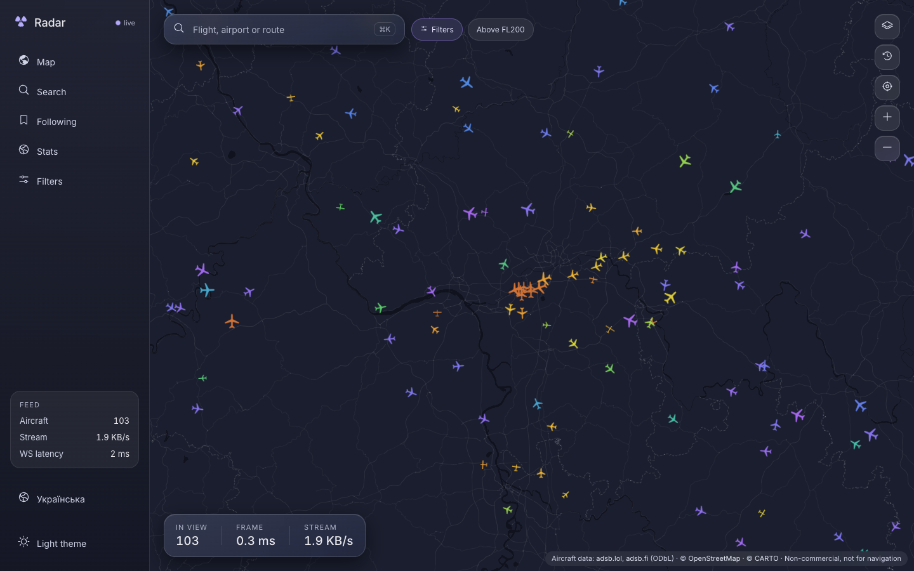
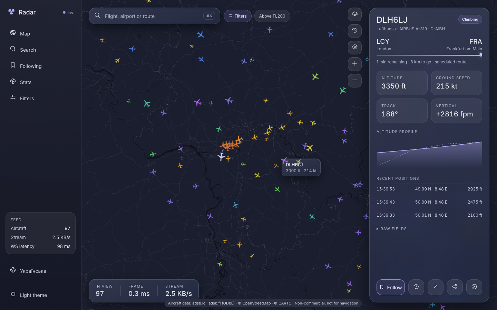
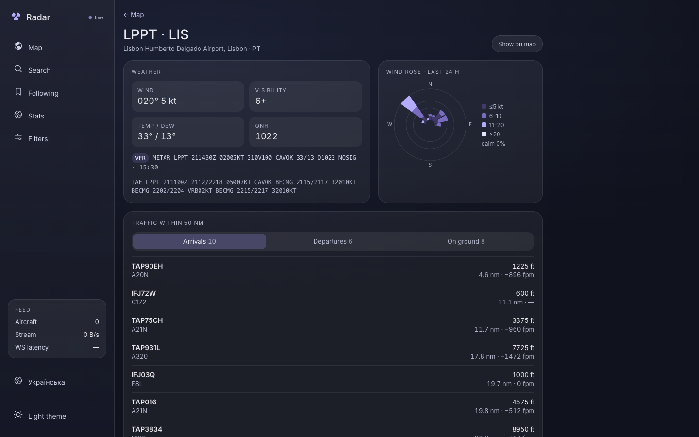
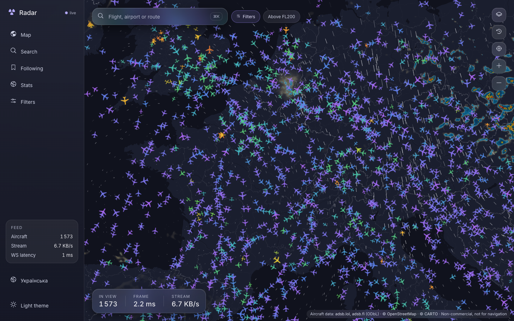
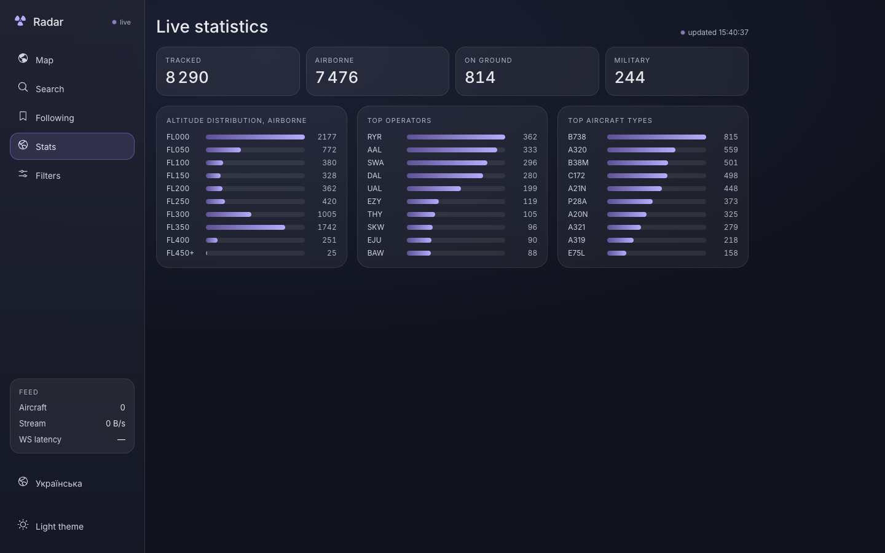
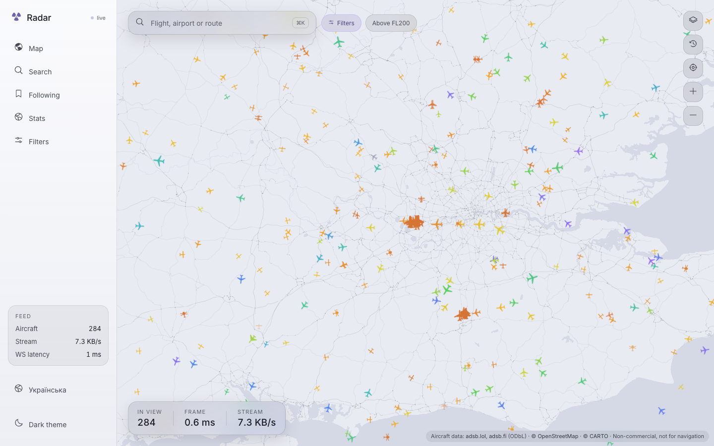
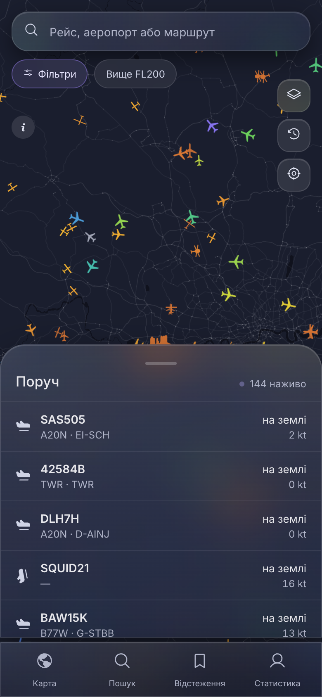

# SkyTrace

Open-source live flight tracker in the spirit of Flightradar24 — a WebGL map
with thousands of aircraft moving smoothly in real time, flight details with
routes and altitude profiles, filters, airport pages with live weather,
history playback and live statistics. Built entirely on **free, public
community ADS-B data**, no receivers, no paid services.

> **Non-commercial project.** SkyTrace is not for commercial use and is **not a
> source of navigational information**. Aircraft data comes from community
> networks under the ODbL — see [ATTRIBUTION.md](ATTRIBUTION.md).



| Flight detail                                          | Airport · weather · traffic                                                           |
| ------------------------------------------------------ | ------------------------------------------------------------------------------------- |
|    |                                     |
| **Radar and wind aloft**                               | **Live statistics**                                                                   |
|  |                                              |
| **Light theme**                                        | **Mobile, Ukrainian**                                                                 |
|          |  |

## Features

- **Live map** — MapLibre GL basemap + deck.gl `IconLayer` on binary
  attributes; 13 top-down silhouettes by ADS-B category; altitude colour ramp
  computed on the GPU; dead reckoning with eased blending between fixes, so
  aircraft move at 60 fps between 1–5 s updates.
- **Viewport streaming** — the browser subscribes to its bounds over one
  WebSocket; the server sends 28-byte binary records, deltas only, with zoom
  degradation (clusters at world scale).
- **Flight detail** — airline, type, registration, scheduled route with
  great-circle progress and ETA, altitude/speed profile (uPlot), recent
  positions, raw fields, follow, planespotters.net link.
- **Search & filters** — callsign, registration, hex, airport, airline;
  altitude/speed bands, operators, types, country of registration,
  military/emergency/LADD; presets; live "Show N flights" count.
- **History** — Parquet (zstd) archive, 72 h retention; recorded trails;
  playback of the last hour at ×1/×10/×60; per-aircraft flight list.
- **Airports** — METAR/TAF, 24 h wind rose, arrivals/departures within 50 nm.
- **Weather layers** — RainViewer precipitation radar, Open-Meteo wind aloft
  as animated particles at FL050/FL180/FL340.
- **Polish** — PWA (installable, offline shell), English and Ukrainian,
  dark/light theme, keyboard shortcuts (`/` or ⌘K search, `f` filters, `Esc`),
  URL as state (`/?lat=38.77&lon=-9.13&z=9&sel=4951ab`).

## Quick start

Requirements: Node ≥ 22.15 (built-in zstd), pnpm 10.

```bash
pnpm install
pnpm dev          # server on :8080 (live ingest), web on :4200
```

Open http://localhost:4200. The first viewport fills within a few seconds;
the rest of the world is refreshed in the background.

| command             | what it does                                                      |
| ------------------- | ----------------------------------------------------------------- |
| `pnpm dev`          | ingest server + Angular dev server in watch mode                  |
| `pnpm check`        | lint + typecheck + unit tests + build + bundle budget + load test |
| `pnpm e2e`          | Playwright: FPS budget, playback, TAP scenario, LPPT, axe audit   |
| `pnpm data:refresh` | re-download and normalize airports, airlines, aircraft types      |

**Production preview** (one process serves API, stream and both locales):

```bash
pnpm turbo run build
WEB_DIST=../web/dist/web/browser NODE_ENV=production pnpm --filter @skytrace/server start
# http://localhost:8080  ·  http://localhost:8080/uk/
```

**Benchmarks without a server:** `http://localhost:4200/?synthetic=5000`
renders 5 000 generated aircraft.

## Configuration (server)

| variable                  | default              | meaning                                         |
| ------------------------- | -------------------- | ----------------------------------------------- |
| `PORT` / `HOST`           | `8080` / `0.0.0.0`   | listen address                                  |
| `PROVIDERS`               | `adsb.fi,adsb.lol`   | `/v2` mirrors in priority order (ADR-002)       |
| `OPENSKY_ENABLED`         | `true`               | OpenSky fallback for uncovered viewports        |
| `HISTORY_DIR`             | `../../data/history` | Parquet archive                                 |
| `HISTORY_RETENTION_HOURS` | `72`                 | archive retention                               |
| `HISTORY_FLUSH_SEC`       | `300`                | archive flush interval                          |
| `EVICT_AFTER_SEC`         | `180`                | drop aircraft not heard from (ADR-003)          |
| `WEB_DIST`                | —                    | serve the web build from this directory         |
| `CORS_ORIGIN`             | `*`                  | allowed origin for a separately hosted frontend |

## Performance budgets (measured)

| budget                       | limit        | measured                             |
| ---------------------------- | ------------ | ------------------------------------ |
| frame time, 5 000 aircraft   | 16 ms        | p95 1.8–2.8 ms, 60 fps (M1 Pro)      |
| initial JS + CSS             | 250 KB gzip  | 132 KB                               |
| stream, 600 aircraft in view | 20 KB/s      | ≤ 16.8 KB/s worst case, ~3 KB/s live |
| server heap, soak            | stable ±10 % | +3.5 % drift over 20 min             |
| WS update p99, 200 clients   | 100 ms       | 33–46 ms                             |
| Lighthouse (map, desktop)    | ≥ 95         | 100 / 100 / 100 / 100                |

Details and trade-offs: [ADR-009](docs/decisions/009-performance-and-lighthouse.md).

## Repository layout

```
apps/
  web/            Angular 20 client (zoneless, signals) — MapLibre GL + deck.gl
  server/         Fastify API, WebSocket stream, ingest worker, history
packages/
  adsb-types/     Zod schemas, normalized Aircraft, filter matching
  protocol/       28-byte binary codec shared by web and server
  geo/            great-circle math, bbox, geohash, dead reckoning, RDP
  static-data/    airports, airlines, aircraft types, ICAO24 → country
scripts/          data refresh, soak test
data/static/      committed datasets (zstd)
docs/decisions/   architecture decision records
```

Architecture overview: [ARCHITECTURE.md](ARCHITECTURE.md).

## Deployment

Designed for free tiers: the API on Fly.io (one machine, a volume for
history), the static site on Cloudflare Pages. `Dockerfile`, `fly.toml`,
`apps/web/public/_redirects|_headers` and `.github/workflows/deploy.yml` are
ready; the workflow skips each target until its secrets/variables exist
(`FLY_API_TOKEN` + `FLY_APP`; `CLOUDFLARE_API_TOKEN`, `CLOUDFLARE_ACCOUNT_ID`,
`CLOUDFLARE_PROJECT`, `API_ORIGIN`). See [ADR-010](docs/decisions/010-deployment.md).

## What SkyTrace deliberately does not have

- **Oceanic coverage** — requires satellite ADS-B, which is a paid feed.
- **MLAT for aircraft without ADS-B** — requires our own receiver network.
- **Airline schedules, real gates and delays** — paid feeds. Routes come from
  free callsign → route databases (adsb.lol, adsbdb.com) and are labelled
  "scheduled route"; implausible matches are flagged.
- **Aircraft photos** — licensed; we link to planespotters.net by hex and
  never host images.

## License

Code: MIT. Data: ODbL and others — see [ATTRIBUTION.md](ATTRIBUTION.md).
